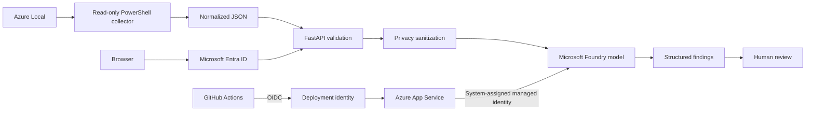
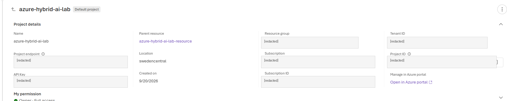
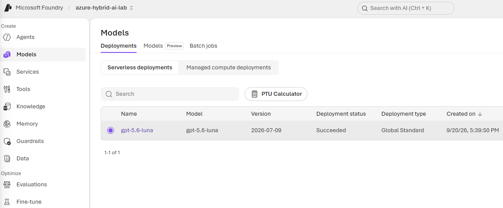
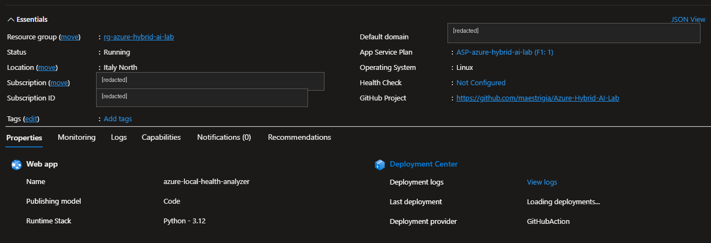
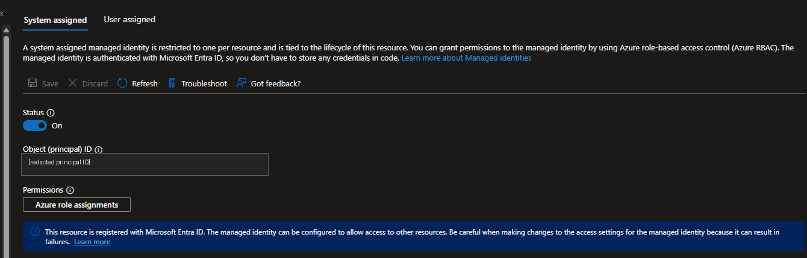
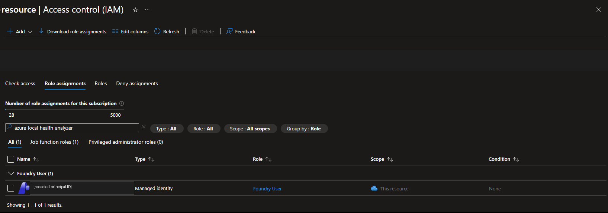
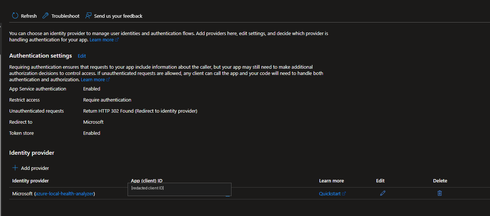
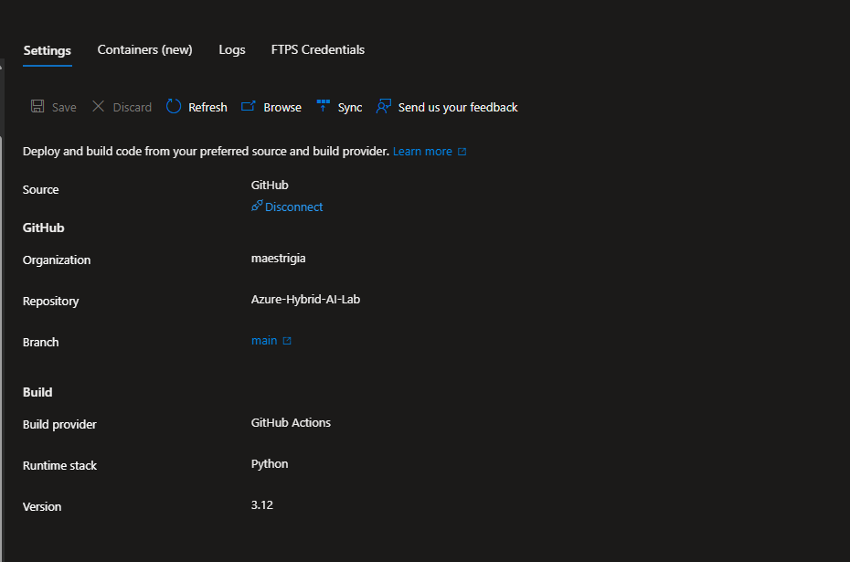

# Azure Local AI Health Analyzer --- Azure Deployment Guide

This guide shows how to reproduce the hosted Azure reference deployment
for the Azure Local AI Health Analyzer.

> **Scope**
>
> This is a reference/lab deployment, not a production architecture.
> Production environments normally require additional work around
> networking, private endpoints, monitoring, availability, secret
> lifecycle, governance, threat modeling, and cost controls.

The application accepts a structured Azure Local health report,
validates it, pseudonymizes infrastructure identifiers covered by the
health-report schema, and submits only the sanitized representation for
AI-assisted analysis.

## Architecture



The deployment deliberately separates three identities:

-   **End-user identity** --- Microsoft Entra ID protects access to the
    hosted web application.
-   **Runtime identity** --- the App Service system-assigned managed
    identity authenticates to Microsoft Foundry.
-   **Deployment identity** --- GitHub Actions uses OpenID Connect
    (OIDC), preferably with a user-assigned managed identity, to deploy
    code to App Service.

No Foundry API key is required by the application.

## Repository components

``` text
ai/health-analyzer/
|-- analyze_health.py
|-- app.py
|-- sanitizer.py
|-- test_sanitizer.py
|-- requirements.txt
|-- requirements-dev.txt
|-- README.md
|-- DEPLOYMENT.md
\-- images/
    \-- azure-local-health-analyzer-web.png

azure-local/health-checks/
|-- Get-AzureLocalHealthSummary-v2.ps1
\-- examples/
    \-- sample-health-report.json

.github/workflows/
\-- main_azure-local-health-analyzer.yml
```

## 1. Prerequisites

You need:

-   An Azure subscription with permission to create resources and assign
    Azure RBAC roles.
-   Azure CLI 2.67.0 or later.
-   Git.
-   Python 3.12 for local validation.
-   A GitHub account and a fork/clone of this repository.
-   Access to a Microsoft Foundry model that supports the API features
    used by the analyzer, including structured output.
-   Permission to create or configure a Microsoft Entra application if
    you enable App Service Authentication.

Sign in to Azure:

``` powershell
az login
```

If you have more than one subscription, explicitly select the target
subscription:

``` powershell
az account set --subscription "<subscription-name-or-id>"
```

Clone the repository:

``` powershell
git clone https://github.com/maestrigia/Azure-Hybrid-AI-Lab.git
cd Azure-Hybrid-AI-Lab
```

Before creating resources, choose your own values:

``` powershell
$LOCATION="<azure-region>"
$RESOURCE_GROUP="<resource-group>"
$FOUNDRY_RESOURCE="<globally-unique-foundry-resource>"
$FOUNDRY_PROJECT="<foundry-project>"
$MODEL_DEPLOYMENT="<model-deployment>"
$APP_PLAN="<app-service-plan>"
$APP_NAME="<globally-unique-app-service-name>"
$APP_SKU="<app-service-sku>"
```

Do not copy resource names, tenant IDs, subscription IDs, principal IDs,
endpoints, or credentials from another deployment.

## 2. Create the Microsoft Foundry resource and project

### Why

Foundry hosts the model used for structured AI-assisted interpretation.
The application does not send the original report to the model;
`sanitizer.py` runs before the Foundry call.

### Azure portal / Foundry portal

1.  Open Microsoft Foundry.
2.  Create a new project.
3.  Use **Advanced options** to select the intended subscription,
    resource group, and region.
4.  Wait until the project is provisioned.
5.  Record the resource name and project name.

### Azure CLI

Create the resource group if required:

``` powershell
az group create `
  --name $RESOURCE_GROUP `
  --location $LOCATION
```

Create a Foundry resource with project management enabled:

``` powershell
az cognitiveservices account create `
  --name $FOUNDRY_RESOURCE `
  --resource-group $RESOURCE_GROUP `
  --kind AIServices `
  --sku S0 `
  --location $LOCATION `
  --custom-domain $FOUNDRY_RESOURCE `
  --allow-project-management
```

Create the project:

``` powershell
az cognitiveservices account project create `
  --name $FOUNDRY_RESOURCE `
  --resource-group $RESOURCE_GROUP `
  --project-name $FOUNDRY_PROJECT `
  --location $LOCATION
```

Verify provisioning:

``` powershell
az cognitiveservices account show `
  --name $FOUNDRY_RESOURCE `
  --resource-group $RESOURCE_GROUP `
  --query properties.provisioningState `
  --output tsv
```

Expected result:

``` text
Succeeded
```

> **Screenshot checkpoint 1 --- Foundry project**
>
> Capture the Foundry project overview showing that the project exists.
> Crop or mask subscription IDs, tenant IDs, endpoints, and other
> identifiers before publishing.
>
> Suggested repository path:


## 3. Deploy a compatible model

### Why

The analyzer passes the deployment name in the `model` field. Model
availability, versions, deployment types, and quota vary by Azure region
and subscription.

### Foundry portal

1.  Open **Discover \> Models**.
2.  Select a model compatible with the Responses API and structured
    output used by this project.
3.  Select **Deploy**.
4.  Choose an available deployment type and capacity.
5.  Record the deployment name.
6.  Test the deployment in the Foundry playground before continuing.

### Azure CLI

First inspect the model versions and SKUs available in your region:

``` powershell
az cognitiveservices model list `
  --location $LOCATION `
  --output table
```

Then deploy a supported combination. Replace all model-specific
placeholders with values actually available in your region:

``` powershell
az cognitiveservices account deployment create `
  --name $FOUNDRY_RESOURCE `
  --resource-group $RESOURCE_GROUP `
  --deployment-name $MODEL_DEPLOYMENT `
  --model-name "<model-name>" `
  --model-version "<model-version>" `
  --model-format OpenAI `
  --sku-capacity <capacity> `
  --sku-name "<supported-sku>"
```

Verify:

``` powershell
az cognitiveservices account deployment show `
  --name $FOUNDRY_RESOURCE `
  --resource-group $RESOURCE_GROUP `
  --deployment-name $MODEL_DEPLOYMENT `
  --query properties.provisioningState `
  --output tsv
```

Do not hard-code a model version from this guide. Azure model
availability and quota change over time.

> **Screenshot checkpoint 2 --- Model deployment**
>
> Capture the Foundry model deployment page with deployment status
> visible. Mask endpoints, subscription details, quota details that you
> do not want public, and any unrelated resources.
>
> Suggested path:


## 4. Determine the OpenAI v1 endpoint

The Python analyzer uses the OpenAI SDK with Microsoft Entra ID and
expects `FOUNDRY_ENDPOINT` to be the OpenAI-compatible v1 base URL.

Use this form:

``` text
https://<foundry-resource>.services.ai.azure.com/openai/v1/
```

Microsoft documentation also supports the equivalent Azure OpenAI
resource hostname where applicable.

Keep this value in App Service configuration. Do not commit a real
endpoint to the repository.

## 5. Create Azure App Service

### Why

Azure App Service hosts the FastAPI web application. This reference
deployment uses Linux and Python.

### Azure portal

1.  Create an **App Service Plan** for Linux.
2.  Create a **Web App**.
3.  Select **Code** rather than a custom container.
4.  Select Python 3.12.
5.  Select a low-cost SKU appropriate for a lab/reference deployment.
    Availability of Free/Shared tiers varies by region and subscription.

### Azure CLI

Create the Linux App Service plan:

``` powershell
az appservice plan create `
  --name $APP_PLAN `
  --resource-group $RESOURCE_GROUP `
  --location $LOCATION `
  --sku $APP_SKU `
  --is-linux
```

Create the Python 3.12 web app:

``` powershell
az webapp create `
  --resource-group $RESOURCE_GROUP `
  --plan $APP_PLAN `
  --name $APP_NAME `
  --runtime "PYTHON:3.12"
```

> **Screenshot checkpoint 3 --- App Service overview**
>
> Capture the App Service overview showing the runtime and deployment
> region, but mask subscription identifiers and unrelated resources.
>
> Suggested path:


## 6. Configure App Service application settings

### Why

The code reads the model endpoint and deployment name from environment
variables. They are intentionally not stored in source control.

Configure:

-   `FOUNDRY_ENDPOINT`
-   `FOUNDRY_DEPLOYMENT`
-   `SCM_DO_BUILD_DURING_DEPLOYMENT=true`

### Azure portal

Open the Web App and go to **Settings \> Environment variables** (the
exact portal label can evolve). Add the three settings and save.

### Azure CLI

``` powershell
az webapp config appsettings set `
  --resource-group $RESOURCE_GROUP `
  --name $APP_NAME `
  --settings `
    FOUNDRY_ENDPOINT="https://<foundry-resource>.services.ai.azure.com/openai/v1/" `
    FOUNDRY_DEPLOYMENT="$MODEL_DEPLOYMENT" `
    SCM_DO_BUILD_DURING_DEPLOYMENT="true"
```

Never put a Foundry API key in the repository or workflow.

## 7. Configure the FastAPI startup command

Python 3.13 and earlier on App Service require an explicit startup
command for FastAPI. This project uses `app.py` and exposes the FastAPI
object as `app`.

For this reference deployment:

``` text
python -m uvicorn app:app --host 0.0.0.0 --port 8000
```

### Azure portal

Open **Settings \> Configuration** and set the startup command to the
value above.

### Azure CLI

``` powershell
az webapp config set `
  --resource-group $RESOURCE_GROUP `
  --name $APP_NAME `
  --startup-file "python -m uvicorn app:app --host 0.0.0.0 --port 8000"
```

The repository deploys the contents of `ai/health-analyzer/` as the App
Service artifact, so `app.py` is at the deployed application root.

## 8. Enable the App Service system-assigned managed identity

### Why

The running application uses `DefaultAzureCredential()` and a
bearer-token provider. In Azure, the App Service system-assigned managed
identity provides the runtime identity used to call Foundry. No static
model API key is needed.

### Azure portal

1.  Open the Web App.
2.  Go to **Settings \> Identity**.
3.  Select **System assigned**.
4.  Set **Status** to **On**.
5.  Save.

### Azure CLI

``` powershell
az webapp identity assign `
  --resource-group $RESOURCE_GROUP `
  --name $APP_NAME
```

Do not publish the returned principal/object ID.

> **Screenshot checkpoint 4 --- Runtime managed identity**
>
> Capture the **System assigned** Identity page with Status = On. Crop
> or mask the Object (principal) ID.
>
> Suggested path:


## 9. Grant the runtime identity access to Foundry

### Why

Enabling a managed identity does not automatically grant it permission
to call another Azure resource. Azure RBAC must authorize the App
Service identity on the Foundry resource.

For this project, assign **Foundry User** to the App Service
system-assigned managed identity at the Foundry resource scope.

> Microsoft renamed several Foundry RBAC roles. Some portal surfaces may
> temporarily display an older Azure AI role name while the rename rolls
> out.

### Azure portal

1.  Open the Foundry resource in Azure.
2.  Go to **Access control (IAM)**.
3.  Select **Add \> Add role assignment**.
4.  Choose **Foundry User**.
5.  For member type, choose **Managed identity**.
6.  Select **App Service** and then your web app.
7.  Review and assign.

> **Screenshot checkpoint 5 --- Foundry RBAC**
>
> Capture the role assignment showing the App Service managed identity
> and `Foundry User`. Mask principal IDs and unrelated identities.
>
> Suggested path:


## 10. Validate locally before deploying

Install runtime and development dependencies:

``` powershell
python -m pip install --upgrade pip
pip install -r .\ai\health-analyzer\requirements.txt
pip install -r .\ai\health-analyzer\requirements-dev.txt
```

Compile the application:

``` powershell
python -m py_compile .\ai\health-analyzer\app.py
python -m py_compile .\ai\health-analyzer\analyze_health.py
python -m py_compile .\ai\health-analyzer\sanitizer.py
```

Run the sanitizer regression suite:

``` powershell
python -m pytest .\ai\health-analyzer\test_sanitizer.py -v
```

The current project contains 12 sanitizer regression tests.

For local Foundry authentication, sign in with Azure CLI:

``` powershell
az login
```

Set the two environment variables only in your local session:

``` powershell
$env:FOUNDRY_ENDPOINT="https://<foundry-resource>.services.ai.azure.com/openai/v1/"
$env:FOUNDRY_DEPLOYMENT="<model-deployment>"
```

Run the CLI analyzer:

``` powershell
python .\ai\health-analyzer\analyze_health.py `
  .\azure-local\health-checks\examples\sample-health-report.json
```

The expected path is:

``` text
JSON -> validation -> privacy sanitization -> Microsoft Entra ID -> Foundry -> structured JSON
```

The console summary is generated locally from the original report. The
report passed to Foundry is the sanitized representation.

## 11. Configure Microsoft Entra authentication for the web application

### Why

App Service Authentication ("Easy Auth") can require users to
authenticate before the FastAPI application is reached. This protects
the hosted reference interface independently from the App Service
managed identity used to call Foundry.

### Azure portal

1.  Open the Web App.
2.  Go to **Settings \> Authentication**.
3.  Select **Add identity provider**.
4.  Choose **Microsoft**.
5.  Use a workforce tenant for an internal organizational deployment.
6.  Create a new app registration or select an existing registration.
7.  Set **Require authentication** for incoming requests.
8.  Configure unauthenticated requests to redirect to the Microsoft
    sign-in page.
9.  Restrict the tenant/issuer according to your intended audience.
10. Save and test in an InPrivate/Incognito browser session.

The exact choices depend on whether the application is intended for one
tenant, multiple tenants, or external identities. Do not blindly copy
another tenant's settings.

If the App Service authentication configuration uses a client secret,
track its expiration. Microsoft also documents managed-identity options
for eliminating stored client secrets in supported configurations.

> **Screenshot checkpoint 6 --- App Service Authentication**
>
> Capture the Authentication page showing Microsoft as the identity
> provider and authentication required. Mask tenant IDs,
> application/client IDs, and secret information.
>
> Suggested path:


## 12. Configure GitHub Actions deployment with OIDC

### Why

GitHub Actions needs a deployment identity, but it should not require a
long-lived Azure password or publish-profile secret. Microsoft
recommends OpenID Connect (OIDC) for hardened GitHub-to-Azure
authentication.

This identity is **not** the App Service runtime managed identity.

### Recommended portal path: App Service Deployment Center

1.  Open the Web App.
2.  Go to **Deployment \> Deployment Center**.
3.  Select **GitHub** as the source.
4.  Select the GitHub organization/account, repository, and `main`
    branch.
5.  Select **GitHub Actions** as the build provider.
6.  Use **User-assigned identity / OpenID Connect** authentication when
    available.
7.  Create or select a user-assigned managed identity.
8.  Ensure the deployment identity has the minimum role required to
    deploy to this Web App; this reference deployment uses **Website
    Contributor** scoped to the Web App.
9.  Save.

Deployment Center can configure the federated relationship between
GitHub and Azure and can generate repository secrets and a workflow.

> **Important for forks**
>
> The secret names in
> `.github/workflows/main_azure-local-health-analyzer.yml` are
> deployment-specific. A fork must configure its own GitHub OIDC
> identity/secrets and update the workflow references accordingly. Never
> copy another deployment's client ID, tenant ID, subscription ID, or
> federated identity.

A typical OIDC login step uses:

``` yaml
permissions:
  id-token: write
  contents: read

steps:
  - name: Login to Azure
    uses: azure/login@v2
    with:
      client-id: ${{ secrets.AZURE_CLIENT_ID }}
      tenant-id: ${{ secrets.AZURE_TENANT_ID }}
      subscription-id: ${{ secrets.AZURE_SUBSCRIPTION_ID }}
```

The deployment step uses `azure/webapps-deploy@v3`.

> **Screenshot checkpoint 7 --- Deployment Center**
>
> Capture the Deployment Center configuration showing GitHub, the
> repository/branch, and user-assigned identity/OIDC authentication.
> Mask IDs and any private repository details.
>
> Suggested path:


## 13. Understand the CI/CD quality gate

The repository workflow:

``` text
push to main
    |
    v
checkout
    |
    v
Python 3.12
    |
    v
install runtime + test dependencies
    |
    v
12 sanitizer regression tests
    |
    v
py_compile validation
    |
    v
build artifact
    |
    v
OIDC login to Azure
    |
    v
deploy to App Service
```

A failed test or Python compilation step prevents the deploy job from
running.

After configuring your own OIDC secrets/identity, push a small
documentation or code change to `main`, or run the workflow manually
from GitHub Actions.

Verify that both **build** and **deploy** complete successfully.

## 14. Verify the hosted application

Open:

``` text
https://<app-service-name>.azurewebsites.net/
```

If Microsoft Entra authentication is enabled, you should first be
redirected to sign in.

After authentication, the upload interface should appear.


Upload:

``` text
azure-local/health-checks/examples/sample-health-report.json
```

Select **Analyze Health Report**.

A successful end-to-end request follows this path:

``` text
Browser
  -> Microsoft Entra ID
  -> Azure App Service / FastAPI
  -> JSON validation
  -> privacy sanitization
  -> App Service system-assigned managed identity
  -> Microsoft Foundry
  -> Pydantic structured result
  -> HTML response
```

The returned AI analysis should reference pseudonymized identifiers such
as `HOST-001`, `GROUP-001`, or `RESOURCE-001` when those identifiers are
relevant to the finding. It should not reproduce the original
infrastructure identifiers covered by the sanitizer.

## 15. Security and privacy verification

Before using any real report, review the sanitizer behavior and the
project disclaimer.

This project implements schema-aware and pattern-based pseudonymization.
It is not a universal data-loss-prevention or anonymization system.

The current sanitizer covers infrastructure identifiers represented in
the health-report schema and selected patterns, including
host/cluster/domain names, cluster groups, resources, volumes, IPv4
addresses, GUIDs, email/UPN-style identities, and Azure Resource IDs.

For customer or production data:

1.  Review the report before upload.
2.  Confirm that the schema and sanitizer cover the identifiers present
    in that report.
3.  Apply your organization's data-handling, privacy, security, and AI
    governance requirements.
4.  Do not assume that arbitrary future fields are automatically safe
    because the current regression tests pass.

## 16. Troubleshooting

### `FOUNDRY_ENDPOINT environment variable is not configured`

Configure `FOUNDRY_ENDPOINT` in App Service Environment variables or in
your local PowerShell session.

### `FOUNDRY_DEPLOYMENT environment variable is not configured`

Set the environment variable to the **deployment name**, not merely the
underlying model name.

### `401` or `403` from Foundry

Check:

-   App Service system-assigned identity is enabled.
-   The App Service managed identity has the required Foundry RBAC role.
-   The endpoint belongs to the intended Foundry resource.
-   The deployment exists.
-   RBAC propagation has completed.

### `400 Model not supported`

The selected deployment might not support the Responses API or the
capabilities used by this analyzer. Choose a compatible
model/deployment.

### App Service starts but FastAPI does not respond

Verify:

-   Python runtime.
-   Startup command.
-   `requirements.txt`.
-   Deployment artifact layout.
-   App Service Log stream.

For Python 3.13 and earlier, explicitly configure the FastAPI startup
command.

### GitHub Actions Azure login fails

Check:

-   `id-token: write` is present in the deploy job.
-   GitHub repository/branch/environment matches the federated
    credential subject.
-   Client, tenant, and subscription values belong to your deployment.
-   The deployment identity has permission on the target Web App.

## 17. Screenshot publishing checklist

Before adding Azure portal screenshots to a public repository, mask or
crop:

-   Subscription IDs.
-   Tenant IDs.
-   Client/application IDs when not needed.
-   Object/principal IDs.
-   Foundry endpoint hostnames if you prefer not to publish resource
    names.
-   User email addresses.
-   Internal resource names unrelated to the example.
-   Secrets, keys, tokens, connection strings, or secret values.
-   Browser bookmarks, account menus, notifications, or other unrelated
    personal information.

Recommended screenshot set:

``` text
ai/health-analyzer/images/deployment/
|-- 01-foundry-project.png
|-- 02-model-deployment.png
|-- 03-app-service-overview.png
|-- 04-system-managed-identity.png
|-- 05-foundry-rbac.png
|-- 06-entra-authentication.png
\-- 07-github-deployment-center.png
```

Only add a screenshot to the guide after it has been reviewed for
public-safe content.

## 18. Reference deployment versus production

This repository demonstrates the engineering flow and identity
boundaries. It intentionally does not claim to be a complete production
architecture.

A production design should separately evaluate:

-   Private networking and private endpoints.
-   Egress controls.
-   Application Insights and centralized monitoring.
-   Availability and scaling.
-   Backup/recovery requirements.
-   Model quota and rate limiting.
-   Cost management.
-   Entra group/user authorization.
-   Managed certificate/custom domain requirements.
-   Security testing and threat modeling.
-   Data retention and organizational AI governance.
-   Infrastructure as Code and policy enforcement.

## Microsoft documentation

The deployment steps above are based on current Microsoft documentation.
Azure portal labels, model availability, quotas, and supported runtime
versions can change, so verify the relevant Microsoft Learn pages when
reproducing the deployment:

-   Microsoft Foundry resource quickstart:
    https://learn.microsoft.com/azure/foundry/tutorials/quickstart-create-foundry-resources
-   Microsoft Foundry model deployment:
    https://learn.microsoft.com/azure/foundry/foundry-models/how-to/deploy-foundry-models
-   Microsoft Foundry RBAC:
    https://learn.microsoft.com/azure/foundry/concepts/rbac-foundry
-   Azure OpenAI / Foundry v1 API:
    https://learn.microsoft.com/azure/foundry/openai/api-version-lifecycle
-   Azure App Service Python quickstart:
    https://learn.microsoft.com/azure/app-service/quickstart-python
-   App Service managed identities:
    https://learn.microsoft.com/azure/app-service/overview-managed-identity
-   App Service Microsoft Entra authentication:
    https://learn.microsoft.com/azure/app-service/configure-authentication-provider-aad
-   GitHub Actions deployment to App Service:
    https://learn.microsoft.com/azure/app-service/deploy-github-actions

## Final validation checklist

A reproducible deployment is complete when another engineer can confirm
all of the following:

-   Foundry resource and project are provisioned.
-   A compatible model deployment is available.
-   App Service runs the FastAPI application.
-   `FOUNDRY_ENDPOINT` and `FOUNDRY_DEPLOYMENT` are configured outside
    source control.
-   App Service has a system-assigned managed identity.
-   The runtime identity is authorized to call Foundry.
-   App Service Authentication redirects unauthenticated users to
    Microsoft Entra ID.
-   GitHub Actions authenticates to Azure through OIDC.
-   Sanitizer regression tests pass before deployment.
-   The public sample report produces a structured AI result.
-   The AI result contains pseudonyms rather than original
    infrastructure identifiers covered by the sanitizer.

At that point, the reference deployment is functioning end to end.


