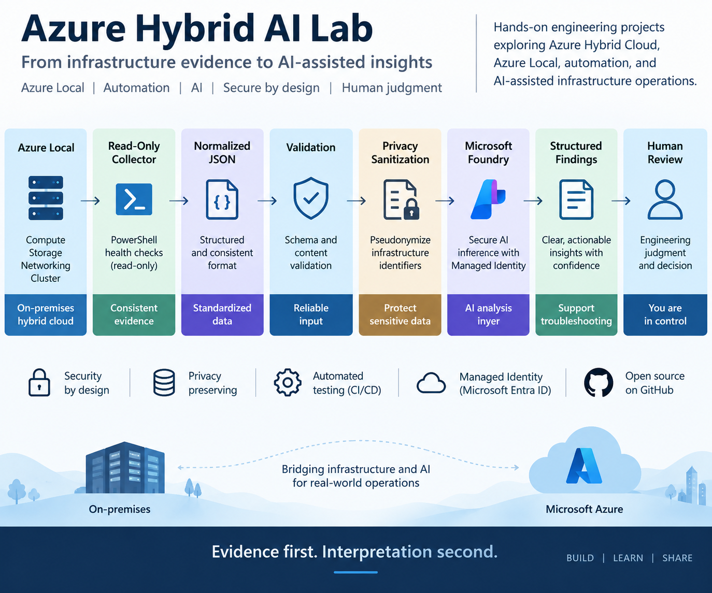

# Azure Local AI Health Analyzer

A lightweight AI-assisted analyzer for structured Azure Local health reports.

The project combines deterministic infrastructure evidence collection, privacy sanitization, and evidence-grounded AI analysis using Microsoft Foundry.

The analyzer does not connect directly to an Azure Local cluster. It consumes a structured JSON health report generated separately by the Azure Local health collector.

## Deployment

For a complete step-by-step guide to reproducing the hosted Azure reference deployment:

**[Azure Deployment Guide](./DEPLOYMENT.md)**

## Architecture

```text
Azure Local
    |
    v
Read-Only PowerShell Collector
    |
    v
AzureLocalHealthSummary.json
    |
    v
Report Validation
    |
    v
Privacy Sanitization
    |
    v
Microsoft Foundry
    |
    v
Structured HealthAnalysis
    |
    v
Human Review
```

The design intentionally separates infrastructure data collection from AI interpretation.

The PowerShell collector gathers deterministic evidence from the environment.

The Python application validates the supplied report and applies privacy sanitization before the report is submitted for AI-assisted analysis.

Microsoft Foundry receives the sanitized report rather than the original uploaded report.

## Web Application

The Azure Local AI Health Analyzer includes a lightweight FastAPI web interface hosted on Azure App Service.

Users can upload a structured health report generated by the read-only PowerShell collector. The application validates the report, applies privacy sanitization, and submits only the sanitized representation for AI-assisted analysis.



The web interface is intentionally simple. The focus of the project is the analysis pipeline, privacy boundary, and structured infrastructure evidence rather than front-end development.

Access to the hosted application can be protected using Microsoft Entra ID authentication.

## Current Capabilities

The analyzer currently supports:

- Structured Azure Local JSON health reports
- Top-level report validation
- Schema-aware infrastructure identity pseudonymization
- Pattern-based sensitive identifier discovery
- Consistent pseudonymization across repeated references
- IPv4 address pseudonymization
- GUID pseudonymization
- Email and UPN-style identity pseudonymization
- Azure Resource ID pseudonymization
- Microsoft Entra ID authentication
- Microsoft Foundry model integration
- Pydantic structured output
- Controlled finding severity values
- Evidence-oriented findings
- Recommended next validation steps
- Identification of additional data requirements
- Command-line analysis
- FastAPI web interface
- Azure App Service hosting
- Managed Identity authentication for the hosted application
- Microsoft Entra ID protection for the web application
- Automated privacy regression tests
- GitHub Actions build, test, and deployment pipeline

## Privacy Sanitization

Infrastructure health reports can contain environment-specific identifiers.

Before AI processing, the application creates a deep copy of the supplied report and pseudonymizes identifiers covered by the current sanitization rules.

Examples include:

```text
Host name                -> HOST-001
Cluster name             -> CLUSTER-001
Domain                   -> DOMAIN-001
Cluster group            -> GROUP-001
Cluster resource         -> RESOURCE-001
Shared volume            -> VOLUME-001
IPv4 address             -> IP-001
GUID                     -> GUID-001
Email / UPN identity     -> IDENTITY-001
Azure Resource ID        -> AZURE-RESOURCE-ID-001
```

Repeated occurrences of the same discovered identifier use the same pseudonym within the report.

This preserves useful relationships such as:

```text
HOST-001 owns GROUP-001
GROUP-001 contains RESOURCE-001
```

without requiring the original infrastructure names to be submitted for AI analysis.

The original input report is not modified by the sanitizer.

### Privacy Boundary

The sanitizer is a targeted privacy control, not a universal anonymization engine.

It protects identifiers covered by the implemented schema-aware and pattern-based rules.

Arbitrary free-form input may contain information that is outside the current detection rules.

For that reason:

- Real production or customer reports should still be reviewed before submission.
- Credentials, secrets, access tokens, or confidential information must never be intentionally supplied.
- Public repository samples must remain synthetic or anonymized.
- Sanitization should not be treated as a substitute for organizational security, privacy, or data-handling requirements.

## AI Analysis Principles

The model is instructed to:

- Use only evidence explicitly present in the supplied report.
- Avoid inventing missing configuration, events, errors, causes, or remediation.
- Avoid treating a `SingleNode` topology as unhealthy by itself.
- Avoid assuming that an `Offline` resource represents a problem without sufficient context.
- Avoid declaring the entire environment healthy based only on successful supplied checks.
- Treat status values as observed evidence unless their meaning is supported by the supplied data.
- Separate observations from conclusions.
- Avoid root-cause claims unless supported by evidence.
- State when the available evidence is insufficient.

AI output is an analysis aid and does not replace engineering validation.

## Structured Output

The analysis uses a Pydantic model with the following structure:

```text
HealthAnalysis
|
+-- overall_assessment
|
+-- findings[]
|   |
|   +-- category
|   +-- severity
|   +-- title
|   +-- evidence[]
|   +-- recommendation
|
+-- recommended_next_checks[]
|
+-- additional_data_required[]
```

Supported finding severity values are:

```text
Informational
Advisory
Warning
Critical
```

Structured output makes the result suitable for API, automation, dashboard, and web-application scenarios without requiring free-form AI text parsing.

## Application Components

### `analyze_health.py`

Implements the core AI analysis workflow.

It loads the health report, authenticates to Microsoft Foundry, requests structured analysis, validates the returned structure with Pydantic, and can write the resulting analysis to JSON.

### `sanitizer.py`

Implements privacy sanitization and consistent pseudonymization before AI processing.

The sanitizer currently handles known infrastructure identities, IPv4 addresses, GUIDs, email/UPN-style identities, and Azure Resource IDs.

### `app.py`

Provides the FastAPI web interface.

The application:

1. Accepts an uploaded JSON report.
2. Parses the JSON input.
3. Validates the required top-level report structure.
4. Sanitizes the report.
5. Sends only the sanitized report to the AI analysis layer.
6. Returns the structured analysis to the user.

The application does not require direct connectivity to the Azure Local cluster.

### `test_sanitizer.py`

Contains automated regression tests for the privacy sanitization layer.

### `requirements.txt`

Contains runtime Python dependencies.

### `requirements-dev.txt`

Contains development and test dependencies such as `pytest`.

## Requirements

- Python 3.12 recommended
- Azure CLI for local Microsoft Entra ID authentication
- Access to a Microsoft Foundry project and compatible model deployment
- Appropriate Microsoft Entra ID permissions for the Foundry resource

Install runtime dependencies:

```powershell
pip install -r requirements.txt
```

Install development/test dependencies:

```powershell
pip install -r requirements-dev.txt
```

The application currently uses:

```text
openai
azure-identity
pydantic
fastapi
uvicorn
python-multipart
pytest (development/testing)
```

## Microsoft Entra ID Authentication

The analyzer does not require a Foundry API key in the source code.

For local development:

```powershell
az login
```

The application uses:

```python
DefaultAzureCredential()
```

with the Azure AI scope:

```text
https://ai.azure.com/.default
```

During local development, `DefaultAzureCredential` can use the authenticated Azure CLI session.

The identity running the analyzer must have the appropriate access to the Microsoft Foundry resource.

Do not publish access tokens, credentials, tenant IDs, subscription IDs, or resource-specific configuration.

## Foundry Configuration

The application reads Foundry configuration from environment variables:

```text
FOUNDRY_ENDPOINT
FOUNDRY_DEPLOYMENT
```

For local development, these can be configured in the current PowerShell session:

```powershell
$env:FOUNDRY_ENDPOINT="https://<your-resource>.services.ai.azure.com/openai/v1"
$env:FOUNDRY_DEPLOYMENT="<your-model-deployment>"
```

No endpoint or model deployment needs to be hard-coded into the Python source.

## Running the Command-Line Analyzer

From the repository root:

```powershell
python .\ai\health-analyzer\analyze_health.py `
    .\azure-local\health-checks\examples\sample-health-report.json
```

The analyzer processes the report and produces structured analysis.

For:

```text
sample-health-report.json
```

the resulting analysis can be written as:

```text
sample-health-report-analysis.json
```

## Running the FastAPI Application Locally

From:

```text
ai/health-analyzer
```

start the application with:

```powershell
python -m uvicorn app:app --host 127.0.0.1 --port 8000
```

Then open the local application in a browser and submit a compatible Azure Local health report.

The web application validates and sanitizes the uploaded report before AI analysis.

## Azure App Service Architecture

The hosted implementation uses separate deployment and runtime identities.

```text
GitHub
   |
   v
GitHub Actions
   |
   | OIDC / federated authentication
   v
Azure Deployment Identity
   |
   v
Azure App Service
   |
   | System-assigned Managed Identity
   v
Microsoft Foundry
```

GitHub Actions uses federated authentication to deploy the application.

The running App Service uses its own system-assigned Managed Identity to access Microsoft Foundry.

This separates deployment permissions from runtime AI permissions and avoids storing a Foundry API key in application source code.

Microsoft Entra ID authentication can additionally protect access to the hosted web application.

## Automated Testing

The current sanitizer regression suite contains 12 tests.

The suite verifies:

- Infrastructure identifier pseudonymization
- Consistent identifier references
- Complete owner-group pseudonymization
- Resource and volume pseudonymization
- Preservation of technical evidence
- Immutability of the original report
- Removal of known sensitive identifiers
- IPv4 pseudonymization
- GUID pseudonymization
- Email and UPN-style identity pseudonymization
- Complete Azure Resource ID pseudonymization
- Invalid IPv4 candidate handling

Run the tests locally with:

```powershell
python -m pytest .\ai\health-analyzer\test_sanitizer.py -v
```

## CI/CD Quality Gate

GitHub Actions performs the following sequence:

```text
Checkout
   |
   v
Set up Python
   |
   v
Install Runtime + Test Dependencies
   |
   v
Run Sanitizer Regression Tests
   |
   v
Validate Python Application
   |
   v
Build Deployment Artifact
   |
   v
Azure Authentication via OIDC
   |
   v
Deploy to Azure App Service
```

The deployment job depends on the build and test job.

If the sanitizer regression tests fail, deployment does not proceed.

This provides a simple automated quality gate for privacy-related changes.

## Example Files

The repository contains synthetic/anonymized examples demonstrating the workflow:

```text
azure-local/health-checks/examples/sample-health-report.json
ai/health-analyzer/examples/sample-health-report-analysis.json
```

Example files must not contain customer or confidential information.

## Security and Privacy

Never commit:

- Customer data
- Credentials
- API keys
- Access tokens
- Tenant identifiers
- Subscription identifiers
- Confidential Microsoft information
- Internal tools or procedures
- Proprietary code
- Non-public troubleshooting material

The sanitizer reduces exposure of identifiers covered by its current rules, but it does not guarantee complete anonymization of arbitrary input.

Human review remains part of the security and privacy boundary.

## Future Direction

Potential next steps include:

- Additional privacy edge-case handling
- Additional deterministic health rules before AI interpretation
- Retrieval-Augmented Generation using authoritative public Microsoft documentation
- Historical health-report comparison
- Trend analysis
- Additional application observability
- Controlled agentic investigation workflows

These are future areas of exploration and are not presented as currently implemented functionality.

## Disclaimer

This project is intended for personal learning, experimentation, and technical demonstration.

It is not an official Microsoft support tool and does not replace official product documentation, support processes, security review, or engineering investigation.

Public examples must not contain customer data, confidential Microsoft information, proprietary code, internal tools, or non-public troubleshooting procedures.
